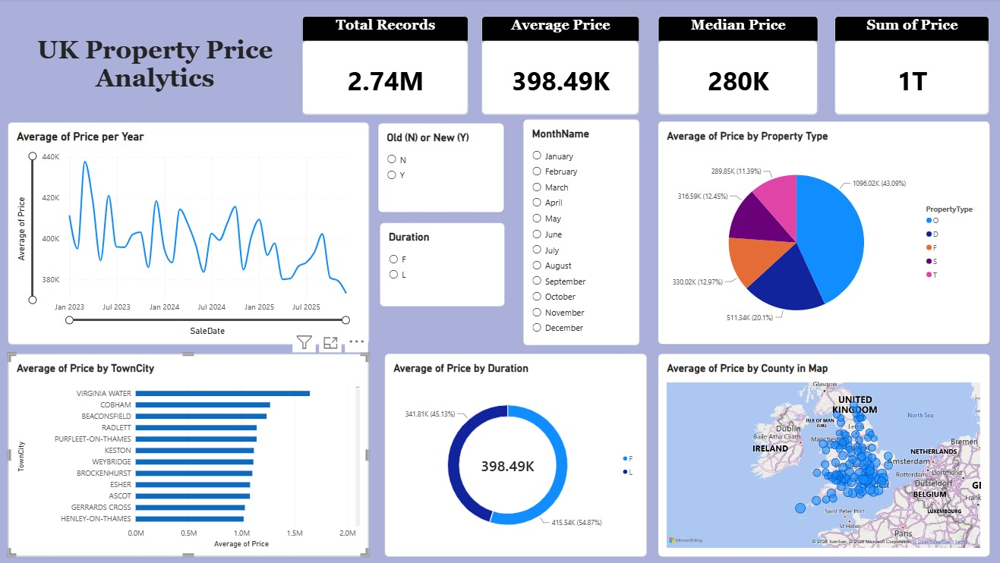

 # UK House Price Prediction

Predicts a property's sale price from its type, tenure, floor area, room count, and
location, using real HM Land Registry Price Paid Data, EPC certificates, and ONS
postcode coordinates (2023–2026).

## Overview

This project builds an end-to-end machine learning pipeline on 2.7M+ real UK property
transactions to predict house prices, and a separate Power BI dashboard for exploring
pricing trends in the underlying data.

## Key Results

| Model | R² | MAE (£) |
|---|---|---|
| Linear Regression | 0.438 | 168,870 |
| Random Forest | 0.407 | 173,821 |
| XGBoost (base features) | 0.458 | 166,395 |
| **XGBoost (final, tuned)** | **0.655** | **112,380** |

- Trained on 2023–2024 sales, tested on 2025 (unseen future year), validated again on 2026.
- Median absolute percentage error: 15.7% on the test set.

## Features Engineered

- Target-encoded postcode district (smoothed average price per district)
- Distance-weighted k-NN spatial feature (average price of the 10 nearest sold properties)
- EPC-derived floor area and room count, joined by postcode + address matching
- Cyclical month encoding (sin/cos) to capture seasonality
- Log-transformed price target to reduce the influence of outliers

## Tech Stack

Python · pandas · scikit-learn · XGBoost · SHAP · Power BI

## Project Structure
├── price_prediction_main.ipynb # full pipeline: cleaning, feature engineering, training, evaluation

├── requirements.txt

├── dashboard_screenshots/ # Power BI dashboard exports

└── README.md

## How to Run

1. Install dependencies: `pip install -r requirements.txt`
2. Download the required data files (see Data Sources below) into the project folder
3. Run `price_prediction_main.ipynb` top to bottom in Jupyter

## Data Sources

- [HM Land Registry Price Paid Data](https://www.gov.uk/government/statistical-data-sets/price-paid-data-downloads)
- [EPC Register](https://epc.opendatacommunities.org/)
- [ONS Postcode Directory](https://geoportal.statistics.gov.uk/)

## Dashboard

A Power BI dashboard built on the cleaned transaction data, analyzing price trends by
property type, tenure, season, and region.

## Model Explainability

SHAP values were used to confirm the model's predictions follow sensible real-world
patterns (e.g. location and floor area are the strongest price drivers).

## Author

Rushali Baradi — [LinkedIn](https://linkedin.com/in/rushali-baradi-a418a4220)
